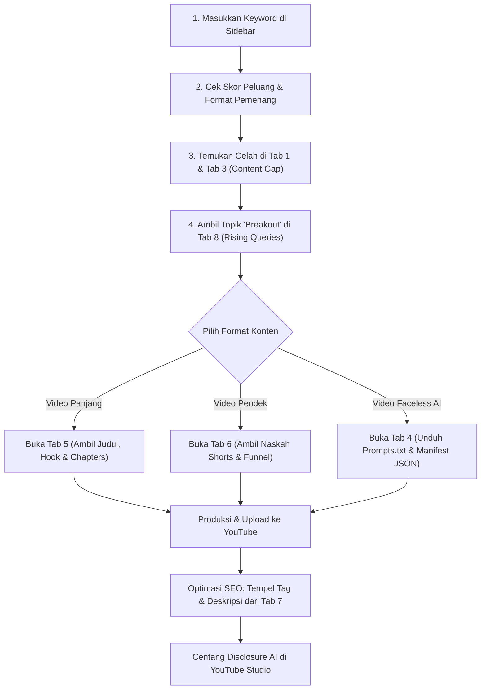

# 📘 Panduan Lengkap Pengguna (Tutorial & SOP)
# YouTube Intelligence, SERP & Trend Analyzer Platform

Selamat datang di platform **YouTube Intelligence & Trend Studio**. Panduan ini dirancang untuk memandu kreator, agensi, dan video marketer memahami seluruh fitur yang tersedia di dashboard, cara menjalankan riset, cara membaca setiap metrik, serta langkah konkret yang harus dilakukan terhadap data tersebut.

---

## 📑 Daftar Isi
1. [Prinsip Kerja & Arsitektur Tool](#1-prinsip-kerja--arsitektur-tool)
2. [Sidebar Parameter Input (Cara Memulai Riset)](#2-sidebar-parameter-input-cara-memulai-riset)
3. [Kartu Ringkasan Strategis (Executive Summary)](#3-kartu-ringkasan-strategis-executive-summary)
4. [Bedah Lengkap 8 Tab Analisis](#4-bedah-lengkap-8-tab-analisis)
   - [Tab 1: 🕵️‍♂️ Intip Kompetitor & AI](#tab-1-️-intip-kompetitor--ai)
   - [Tab 2: 🔥 YouTube Trending Feed](#tab-2--youtube-trending-feed)
   - [Tab 3: 🔬 YouTube Studio & Content Gap](#tab-3--youtube-studio--content-gap)
   - [Tab 4: 🎬 Studio Storyboard Video AI](#tab-4--studio-storyboard-video-ai)
   - [Tab 5: 📺 Rencana Video Landscape (16:9)](#tab-5--rencana-video-landscape-169)
   - [Tab 6: 📱 Rencana Video Shorts (9:16)](#tab-6--rencana-video-shorts-916)
   - [Tab 7: 🌐 Cross-Surface Keywords](#tab-7--cross-surface-keywords)
   - [Tab 8: 📈 Tren Google vs YouTube](#tab-8--tren-google-vs-youtube)
5. [Alur Kerja Eksekusi Konten A-sampai-Z (Actionable Blueprint)](#5-alur-kerja-eksekusi-konten-a-sampai-z-actionable-blueprint)

---

## 1. Prinsip Kerja & Arsitektur Tool

Platform ini mengintegrasikan **Google Trends Data Engine**, **YouTube Live SERP Scraper**, dan **AI Content Intelligence System** tanpa ketergantungan pada API key berbayar pihak ketiga:
- **Analisis Multi-Surface**: Membandingkan apa yang dicari orang di mesin pencari teks Google Web dengan perilaku penonton video di YouTube.
- **Deteksi Kepatuhan AI**: Menganalisis konten kompetitor untuk mendeteksi apakah video dibuat dengan AI (*synthetic content*) sesuai standar YouTube Disclosure Policy.
- **Zero-Watermark & White-Label**: Tampilan bersih, profesional, dan fokus pada strategi data-driven tanpa embel-embel status teknis database.

---

## 2. Sidebar Parameter Input (Cara Memulai Riset)

Di sisi kiri layar (Sidebar), terdapat panel konfigurasi riset utama:

| Parameter | Fungsi & Rekomendasi Pengaturan |
| :--- | :--- |
| **Kata Kunci Utama (Seed Keyword)** | Masukkan topik utama yang ingin Anda buat videonya. *Contoh: `Google Ads Pemula`, `Saham Dividen`, `Wisata Jepang`, `Resep Kue Lebaran`.* |
| **Pilih Lokasi Riset (GL)** | Tentukan negara target penonton Anda. Pilih **ID (Indonesia)** untuk audiens lokal, atau **US (United States)** jika Anda menargetkan penonton global berbahasa Inggris. |
| **Bahasa Hasil (HL)** | Sesuaikan dengan bahasa penonton Anda (`id` untuk Bahasa Indonesia, `en` untuk Bahasa Inggris). |
| **Device Target** | Pilihan antara **Mobile** (representasi penonton HP/Shorts) atau **Desktop** (representasi penonton PC/TV). |
| **Jendela Waktu Tren** | Rentang waktu analisis Google & YouTube Trends. Pilihan: *Past 1 Hour, Past 4 Hours, 1 Hari, 7 Hari Terakhir, 30 Hari Terakhir, atau 12 Bulan Terakhir*. |
| **🚀 Mulai Riset** | Klik tombol ini untuk menjalankan scraping live SERP, analisis tren, deteksi outlier, dan kalkulasi blueprint konten secara bersamaan. |

---

## 3. Kartu Ringkasan Strategis (Executive Summary)

Setelah tombol **🚀 Mulai Riset** ditekan, bagian atas dashboard akan langsung menampilkan 4 metrik penting untuk pengambilan keputusan cepat:

### 1. Skor Peluang Algoritma (0 - 100)
- **Cara Membaca**: Menghitung rasio antara volume pencarian (*demand*) dengan tingkat kejenuhan kompetitor (*supply*).
  - 🟢 **80 - 100 (Sangat Layak / Greenlight)**: Pasar sangat lapar informasi, kompetisi rendah atau kualitas video yang ada saat ini sudah ketinggalan zaman.
  - 🟡 **60 - 79 (Layak Bersyarat)**: Pasar kompetitif. Anda wajib memiliki sudut pandang unik (*angle unik*) atau visual hook yang lebih kuat dari ranking 1 saat ini.
  - 🔴 **Di bawah 60 (Jenuh / Red Ocean)**: Didominasi oleh channel raksasa dengan ratusan ribu views. Disarankan memilih turunan kata kunci (*long-tail keyword*).

### 2. Estimasi RPM & Monetisasi Niche
- **Cara Membaca**: Menampilkan perkiraan pendapatan AdSense per 1.000 penayangan (*Revenue Per Mille*) berdasarkan kategori niche kata kunci (misal Finance/Tech berkisar $8 - $25, Entertainment/Vlog berkisar $1.5 - $4).
- **Tindakan**: Jika RPM niche rendah, jangan hanya mengandalkan AdSense; siapkan strategi monetisasi alternatif seperti affiliate link, sponsor, atau produk digital sendiri di deskripsi.

### 3. Rasio AI di SERP
- **Cara Membaca**: Menampilkan persentase video peringkat 1-10 yang menggunakan format generator AI (animasi sintetis, ElevenLabs voiceover, klip B-roll AI).
- **Tindakan**: Jika rasio AI masih 0% (*Human Dominant*), ini adalah peluang emas menjadi *first-mover* menyajikan konten berbasis AI berkualitas dengan kecepatan produksi 5x lebih cepat.

### 4. Format Pemenang (Landscape 16:9 vs Shorts 9:16)
- **Cara Membaca**: Menunjukkan format video mana yang saat ini mendominasi peringkat teratas untuk kata kunci tersebut.
- **Tindakan**: Buat format video yang direkomendasikan terlebih dahulu sebagai konten utama.

---

## 4. Bedah Lengkap 8 Tab Analisis

### Tab 1: 🕵️‍♂️ Intip Kompetitor & AI
- **Isi Fitur**:
  - Tabel live 10 video teratas di YouTube untuk kata kunci Anda, memuat: Peringkat, Judul, Nama Channel, Total Views, Umur Upload, Durasi, Format (Landscape/Shorts), dan Estimasi Kecepatan Tontonan per Jam (VPH).
  - Kolom **Badge Altered / AI Video**: Mendeteksi video yang memiliki ciri AI (suara sintetis, hashtag #ai, visual generative).
- **Cara Membaca & Menggunakan Data**:
  1. Klik link video kompetitor untuk mempelajari thumbnail dan 5 detik pertama video mereka.
  2. Perhatikan kolom **Kecepatan Views (VPH)**: Jika video berumur 2 minggu memiliki VPH sangat tinggi, berarti topik tersebut sedang viral saat ini.
  3. Baca panduan kepatuhan di bawah tabel: Selalu centang *"Altered or synthetic content"* di YouTube Studio jika video Anda menggunakan AI agar akun aman dari penalti.

---

### Tab 2: 🔥 YouTube Trending Feed
- **Isi Fitur**:
  - Menampilkan daftar video yang sedang nangkring di halaman resmi *YouTube Trending* sesuai negara dan kategori yang Anda pilih (Semua, Musik, Gaming, Berita).
  - Indikator **🔥 VIRAL BREAKOUT**: Menandai video dari channel kecil yang berhasil meledak melampaui rata-rata views channelnya.
- **Cara Membaca & Menggunakan Data**:
  - Video *Viral Breakout* adalah tambang emas inspirasi: Amati topik apa yang sedang dibicarakan, lalu segera buat video versi Anda dengan kata kunci yang relevan dalam waktu 24–48 jam selagi gelombang minat masih tinggi.

---

### Tab 3: 🔬 YouTube Studio & Content Gap
- **Isi Fitur**:
  - **Deteksi Celah Konten (Content Gap)**: Menganalisis pencarian penonton yang belum dijawab secara memuaskan oleh video-video yang sudah ada.
  - **Autocomplete SERP Expansion**: Menampilkan daftar query yang otomatis disarankan oleh mesin pencari YouTube saat penonton mengetikkan kata kunci tersebut.
- **Cara Membaca & Menggunakan Data**:
  - Jika muncul tag *"High Search Demand / Outdated Competitor"*, itu tandanya video teratas sudah usang (misal info 2-3 tahun lalu). Buat video versi update tahun 2026 untuk merebut posisi peringkat 1.

---

### Tab 4: 🎬 Studio Storyboard Video AI
- **Isi Fitur**:
  - Generator storyboard adegan demi adegan (*scene-by-scene*) otomatis yang dirancang khusus untuk video AI tingkat lanjut.
  - Opsi Rasio Aspek: **Landscape (16:9)** untuk video panjang atau **Shorts (9:16)** untuk video vertikal.
  - Opsi Jumlah Scene: 3 hingga 5 adegan terstruktur (Hook 0-5 detik, The Problem, The Solution, Execution, Call To Action).
  - Setiap adegan dilengkapi: **Prompt Visual AI Video** (cinematic lighting, camera angle), **Pergerakan Kamera**, dan **Naskah Narasi / Audio Script**.
  - **Tombol Ekspor 1**: Unduh `prompts.txt` untuk langsung di-generate secara batch pada generator video AI modern (Kling AI, Runway Gen-3, Luma Dream Machine, OpenAI Sora, Haiper).
  - **Tombol Ekspor 2**: Manifest JSON siap pakai untuk diimpor ke timeline editor video (CapCut / Premiere Pro).
- **Cara Menggunakan**:
  1. Salin prompt visual per scene ke generator video AI pilihan Anda.
  2. Salin naskah narasi ke ElevenLabs atau software text-to-speech berkualitas tinggi untuk menghasilkan suara narator.
  3. Gabungkan klip video dan audio di CapCut / Premiere Pro, lalu pasang subtitle dinamis.

---

### Tab 5: 📺 Rencana Video Landscape (16:9)
- **Isi Fitur**:
  - **Rekomendasi Judul Psikologis**: Diformulasikan berdasarkan pola judul video pemenang di YouTube SERP.
  - **Hook Naskah 15 Detik Pertama**: Pola pembuka video agar penonton tidak menekan tombol *back* atau keluar dari video Anda.
  - **Struktur Bab & Timestamps**: Kerangka bab video lengkap (00:00 Intro Hook, 01:15 Masalah Utama, dst.) yang siap di-copy langsung ke kolom Deskripsi YouTube untuk memicu fitur *Chapters* di YouTube player.

---

### Tab 6: 📱 Rencana Video Shorts (9:16)
- **Isi Fitur**:
  - Pola hook visual cepat untuk 3 detik pertama video Shorts.
  - Naskah padat berdurasi 45 detik dengan tempo cepat untuk menjaga retensi penonton di atas 80%.
  - **Strategi Related Video Funnel**: Panduan teknis memasang video panjang Anda di pengaturan *"Related Video"* pada Shorts untuk menyedot jutaan penonton Shorts menjadi penonton setia video panjang.

---

### Tab 7: 🌐 Cross-Surface Keywords
- **Isi Fitur**:
  - Matriks pemetaan niat pencarian (*Search Intent*) di 3 ekosistem:
    1. **Google Web Search (Informational / Definisi)**: Apa yang dicari orang saat mencari artikel/teks.
    2. **YouTube Video Search (How-To / Step-by-Step)**: Apa yang dicari penonton saat ingin melihat tutorial praktis.
    3. **AI Search Prompts (Deep Problem Solving)**: Apa yang ditanyakan orang ke ChatGPT, Gemini, atau Claude.
- **Cara Menggunakan Data**:
  - Masukkan kata kunci YouTube ke Judul dan Tag video.
  - Masukkan kata kunci Google dan AI ke dalam Deskripsi video (minimal 200 kata) agar video Anda juga muncul di Google Web SERP dan AI Overview.

---

### Tab 8: 📈 Tren Google vs YouTube
- **Isi Fitur**:
  - **Grafik Momentum Minat Sepanjang Waktu (Interest Over Time)**: Membandingkan secara langsung kurva pencarian Google Search vs YouTube Search.
  - **Minat Berdasarkan Wilayah (Interest by Region)**: Menampilkan provinsi atau negara bagian dengan volume pencarian tertinggi.
  - **Tabel 50 Top Queries & 50 Rising Queries**:
    - *Top Queries*: 50 kata kunci paling populer dengan skala volume 0-100.
    - *Rising Queries*: 50 kata kunci yang mengalami lonjakan pencarian drastis (+X% atau *Breakout*).
- **Cara Membaca & Menggunakan Data**:
  - Jika kurva YouTube sedang menanjak tajam, segera rilis video dalam 24 jam.
  - Fokus pada query yang berstatus **Breakout** pada tabel Rising Queries; ini adalah kata kunci viral baru yang belum banyak dibuatkan video oleh kompetitor lain!

---

## 5. Alur Kerja Eksekusi Konten A-sampai-Z (Actionable Blueprint)

Berikut adalah panduan langkah demi langkah saat Anda ingin memproduksi konten baru:

Dengan mengikuti alur di atas, Anda memproduksi konten berdasarkan data riil yang sedang dicari jutaan penonton, meminimalkan resiko video sepi, dan memaksimalkan potensi viralitas di algoritma YouTube 2026.
